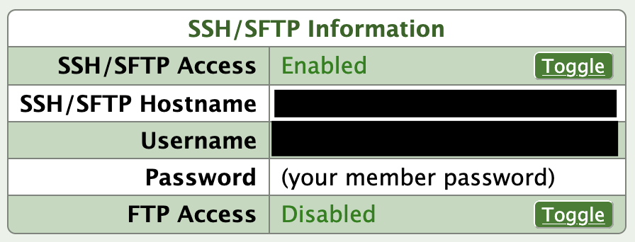
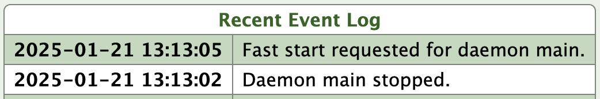

# nfsn-example

This repository contains an example of how to build a Go app and automatically deploy it to [NearlyFreeSpeech.net](https://www.nearlyfreespeech.net/).
NearlyFreeSpeech.net is a web hosting serving with usage-based billing.
In addition to static sites, they offer a variety of built-in services as well as allowing you to host your own long-running daemons i.e., you can bring your own server app.

This repository shows how to use Github actions to

0. Create a new site on NearlyFreeSpeech.net
1. Building a simple webserver using Go
2. Creating a wrapper script for the webserver
3. Deploy the server to NearlyFreeSpeech.net
4. Configure the Daemon and Proxy
5. Automatically restart the server

## 0. Create a New Site on NearlyFreeSpeech.net

Log in, and go to the "sites" tab, and click "create new site."

1. "Short name": your site will by default be accessible at `https://<short name>.nfshost.com`.
2. DNS: you can leave all this blank and set "Set up DNS for new domains?" to "no." You can configure this later.
3. Server Type: Choose "custom": we are bringing our own binary and don't need NearlyFreeSpeech.net to provide anything.
4. Site Plan: Since you're just trying this out, select "Non-production". You can upgrade this later.

## 1. Building the App

Currently, NearlyFreeSpeech.net provides a FreeBSD environment running on x86-64.
Go supports cross-compiling out of the box, so regardless of where you compile the app, you just provide `GOOS` and `GOARCH` environment variables.

```bash
GOOS=freebsd GOARCH=amd64 go build ./...
```

## 2. Create a Wrapper Script

If your server wants any environment variables set, you'll need to create a wrapper script.
In our example, we provide the bearer token for the shutdown endpoint (see [Automatically Restart the Server](#5-automatically-restart-the-server)) via an environment variable, so we have a simple wrapper script like this, which sets a variable and runs the app.

```bash
#!/bin/sh
set -eou pipefail
export BEARER_TOKEN="$$BEARER_TOKEN"
/home/protected/app
```

## 3. Deploy to NearlyFreeSpeech.net

NearlyFreeSpeech.net doesn't have any direct integration with Github; deployment is achieved the old-fashioned way, by copying your files to the server.

Go to the site information page, and you'll see something like this containing the information you'll need to upload files to your site:



Create three actions secrets containing the site information:

* `NFSN_HOSTNAME`: "SSH/SFTP Hostname" (not the URL that your visitors use to see the site)
* `NFSN_USERNAME`: "Username" (not necessarily the same username you log in with)
* `NFSN_PASSWORD`: The password you log into NearlyFreeSpeech.net with
* `NFSN_SHORTNAME`: The "shortname" you gave your site

We will use these secrets in the Github Action to `rsync` our compiled binary to the site:

```bash
sshpass -p "${{ secrets.NFSN_PASSWORD }}" \
  rsync -avz \
    -e "ssh -o StrictHostKeyChecking=no" \
    --delete protected/ "${{ secrets.NFSN_USERNAME }}"@"${{ secrets.NFSN_HOSTNAME }}":/home/protected/
```

We create these secrets so that this information does not appear in your GitHub actions logs.
You definitely don't want your password to appear, but I don't see any reason to reveal the other information either.

This command moves the contents of the `protected/` directory to `/home/protected` in the NearlyFreeSpeech.net site.
It uses `sshpass` fill your password in `rsync`'s SSH authentication prompt.
Since GitHub actions are ephemeral, each time it runs, it will appear that this is the first time you've used SSH to connect to NearlyFreeSpeech.net: `-e "ssh -o StrictHostKeyChecking=no"` tells SSH to skip the prompt for you to okay the remote host key.
`--delete` causes `rsync` to delete anything in `/home/protected` that is not in `protected/`, meaning you can remove or rename your generated files, and the corresponding change will be made on the NearlyFreeSpeech.net site.

## 4. Configure the Daemon and Proxy

**Forward accesses to whatever port your app listens on**

In this example, our app listens on port 8080, so we need to forward HTTP accesses to that port.

Site Information > Add a Proxy

* Protocol: HTTP
* Target Port: 8080

**Start Server Process**

We need to tell NearlyFreeSpeech.net to run the app we've uploaded.

Site Information > Add Daemon

* Command: /home/protected/run.sh

## 5. Automatically Restart the Server

After the GitHub action deploys the new app to the NearlyFreeSpeech.net site, we're not quite done yet.
If we were just deploying static files, the next time we browsed to the site, NearlyFreeSpeech.net would just serve us the updated files.
For our app, though, NearlyFreeSpeech.net will still be running the old binary.

Fortunately, NearlyFreeSpeech.net will try to restart our daemon command if the daemon exits.
So, we build a `/shutdown` endpoint into our app, and hit that endpoint from the GitHub action.
The `/shutdown` endpoint is protected by a `Authentication: Bearer ...` header, so the GitHub action has to provide the expected secret token.

```bash
curl -X POST -H "Authorization: Bearer ${{ secrets.BEARER_TOKEN }}" "https://${{ secrets.NFSN_SHORTNAME }}.nfshost.com/shutdown"
```

Create another actions secret to support this:

* `BEARER_TOKEN`: the token that the daemon will look for on the "/shutdown" endpoint

When our app starts, it will try to read this from the environment.
The GitHub action reads this secret and puts it into the `run.sh` script, which we also deploy to the server.

You'll see in the site event log that the daemon shuts down, and a few seconds later it will automatically be restarted, which launches the new binary.


